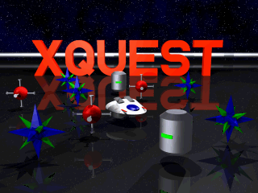
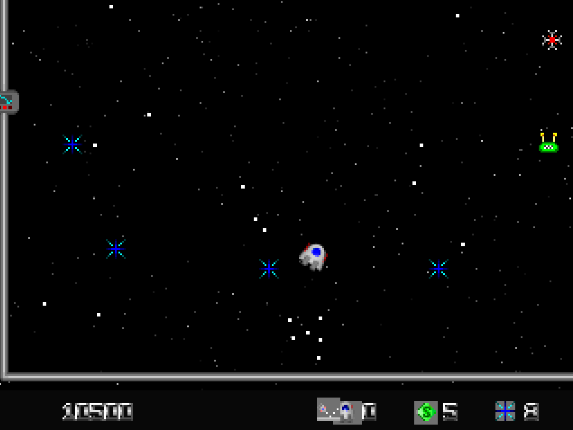
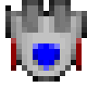
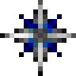
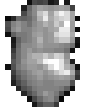
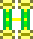
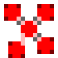
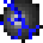

# XQuest, still going after 30 years

<p align="center">
  
</p>

<p align="center">
  
</p>

I first played **XQuest** as DOS shareware sometime in the mid-90s, and it
never really left. Different machines, different decades, same jolly
little ship dingus flying around blowing things up for gem thingies. This
is my attempt to make sure it never has to leave - a faithful, native
Linux/SDL2 port of **XQuest v1.3**, the arcade shooter Mark Mackey wrote
in Turbo Pascal and released as shareware in 1994–1996. Same physics,
same 50 levels, same 18 enemy types, same demented sense of humour in the
original docs. No DOSBox required.

> The invasion fleet of the hideous Mucoids is hurtling towards the
> Earth, intent on blasting it into tiny steaming shreds of radioactive
> grit, and only your ship, armed with our latest top secret Super
> Kill-o-Zapper Atomic Phaser Photon Laser Cannons can... hang on, sorry,
> wrong game. You're a jolly little ship dingus which shoots around a
> rather abstract landscape collecting little gem thingies, while
> avoiding mines. Boring, you say? Well, we kept the Super Kill-o-Zapper,
> and added LOTS of things to blow up. Happy?
>
> - *the original XQuest manual, Mark Mackey, 1994*

Fun fact: Mark Mackey himself informally called this release **"The
Long-awaited XQuest 2"** on his own page - same game, same version
(1.3), just his own excited branding for the update that added
two-player support, three new enemies, and the pixel-collision fix.
There's no separate "XQuest 2" sequel floating around out there; this
is it.

> All gameplay, levels, and original assets are the work of Mark Mackey.
> This port exists so the game can keep running on hardware Mark never
> imagined, without an emulator in between.

---

## Requirements

- Linux (x86-64)
- SDL2 (`libsdl2-dev`)
- CMake 3.16+
- GCC or Clang (C99)
- Python 3 (for the asset-conversion step)

## Asset files

The full game data ships in `assets/`. Clone it and build it; there's
nothing else to fetch.

```
xquest.gfx    sprites (ship, enemies, fonts, gates, HUD icons)
xquest.fnt    small status-bar font
xquest2.fnt   large menu font
xquest.enm    enemy definitions
xquest.snd    sound effects (8-bit 11025 Hz mono PCM)
startpic.pbm  title screen banner
```

If you want to refresh these from a different or newer original
distribution, `scripts/fetch-assets.sh` copies them in from a sibling
`../xquest` directory (or set `XQUEST_SRC=/path/to/xquest`).

## Build

```sh
cmake -B build
cmake --build build
./build/xquest
```

To point the build at a different asset directory:

```sh
cmake -B build -DXQUEST_ASSET_DIR=/path/to/xquest
cmake --build build
```

---

## How to play

### Objective

Each level scatters a set of **crystals** across the game world. Fly
over them to collect them. Once every crystal is collected, the **exit
gate** at the top of the screen opens - fly through it to advance.

Watch out for **mines** - flying into one destroys your ship instantly,
unless a Shield powerup is active.

### The game world

The world (392×320 logical pixels) is larger than the viewport
(320×217). The camera scrolls to keep your ship near the centre. The
border is a 5-line 3D pipe. Enemy entry gates sit in the left and right
walls at mid-height; enemies materialise from them with a short
animation.

### Difficulty

Chosen from the main menu before the game starts.

| Level | Effect |
|-------|--------|
| Wimp | 0.7× speed, 0.7× spawn rate, ship bounces off walls |
| Timid | 1.0× speed, 1.0× spawn rate, ship bounces off walls |
| Average | 1.0× speed, 1.0× spawn rate |
| Tricky | 1.5× speed, 1.2× spawn rate |
| Inhuman | 2.0× speed, 1.5× spawn rate |

Make it to Inhuman and, per the original manual, you're due "a UUencoded
GIF of a tenner" from Mark Mackey personally. Offer status: unconfirmed,
30 years on.

---

## Controls

### In-game

| Action | Keyboard | Mouse |
|--------|----------|-------|
| Move ship | Arrow keys or WASD | Move mouse |
| Fire | Space or Enter | Left button |
| Auto-fire (RapidFire powerup) | Hold Space or Enter | Hold left button |
| Brake (halve velocity) | Left Shift, Right Shift, or Numpad 5 | - |
| Smart bomb | - | Right button |
| Quit to menu | Escape | - |

Movement is **momentum-based**: your ship accelerates in the pressed
direction and keeps drifting when you release. Use Brake to shed speed.
Firing inherits your current velocity - a fast ship fires fast missiles.

### In the menu

| Key | Action |
|-----|--------|
| Up / Down | Navigate items |
| Left / Right or Enter | Cycle difficulty |
| Enter on Start Game | Begin |
| Escape | Quit |

---

## Powerups

Powerups are granted by collecting **Supercrystals** - fast-moving
bouncing sprites that appear in later levels. Each Supercrystal grants
one randomly chosen powerup. Active powerups are shown as icons in the
centre of the status bar; they blink when about to expire.

| Icon slot | Powerup | Duration | Effect |
|-----------|---------|----------|--------|
| 0 | **Shield** | ~10–25 s | Absorbs one source of damage; ship cannot be destroyed |
| 1 | **AimedFire** | ~30–90 s | Missiles automatically lead the nearest enemy |
| 2 | **RapidFire** | ~60–135 s | Fires continuously every 4 frames while the fire button is held |
| 3 | **MultiFire** | ~60–135 s | Each shot fans out into three missiles (±10°) |
| 4 | **AssFire** | ~60–135 s | Each shot also fires a missile in the opposite direction |
| 5 | **HeavyFire** | ~60–135 s | All missiles kill enemies in a single hit regardless of HP |
| 6 | **Bounce** | ~30–90 s | Missiles bounce off the world border instead of disappearing |

MultiFire and AssFire stack - with both active, each trigger fires five
missiles. AimedFire overrides the direction of all of them.

A special Supercrystal result (cases 16–17 in the original code) instantly
**clears all mines** from the level and grants a brief Shield.

---

## Enemies

Levels introduce enemy types progressively. All 18 types are active by
level 36 onwards.

<p align="center">
  
  
  
  
  
  
  
  <br>
  <sub>Ship, SuperCrystal, Hibernator, Meeby, Retaliator, Tribbler, Repulsor - straight from xquest.gfx</sub>
</p>

| # | Name | Behaviour |
|---|------|-----------|
| 0 | SuperCrystal | Fast random bouncer; grants a powerup on contact |
| 1 | Explosion | Death sprite only; no collision |
| 2 | Grunger | Slow random wanderer |
| 3 | Zippo | Fast, curves through the level |
| 4 | Zinger | Curves and fires random shots |
| 5 | Vince | Bounces off walls |
| 6 | Hibernator | Stationary until struck; very high HP |
| 7 | Miner | Curves and lays mines |
| 8 | Meeby | Slow but follows the player; 5 HP |
| 9 | Retaliator | Fires a burst when hit |
| 10 | Terrier | Charges the player when it changes direction |
| 11 | Doinger | High fire rate |
| 12 | Snipe | Fires aimed shots |
| 13 | Tribbler | Splits into 5 smaller enemies (Tribbles) on death |
| 14 | Tribble | Fast curving spawn of Tribbler |
| 15 | Buckshot | Very high fire rate |
| 16 | Cluster | Explodes into projectiles on death |
| 17 | Sticktight | Relentlessly follows the player |
| 18 | Repulsor | Pushes the player away; highest score value (7500 pts) |

Score values range from 200 (Grunger) to 7500 (Repulsor). Meeby is worth
2000 pts.

---

## HUD

```
[ score ]          [ powerup icons ]          [ship] lives  [bomb] bombs  [crystal] crystals
```

- **Score** - bottom-left, 8-digit display.
- **Powerup icons** - centre strip, up to 7 icons. Blink when expiring.
- **Lives** - ship icon followed by remaining extra lives (does not count
  the current life).
- **Smart bombs** - bomb icon followed by inventory count.
- **Crystals** - crystal icon followed by number collected this level.

---

## Packaging

- `cmake --install` installs to `/usr/games` + `/usr/share/games/xquest`,
  Debian-convention paths.
- `debian/` - Debian packaging (`xquest` + `xquest-data` binary packages).
- `scripts/build-appimage.sh` - builds a portable AppImage.

---

## Original game

- **Author:** Mark Mackey (Atomjack)
- **Version ported:** XQuest 1.3
- **Year:** 1994–1996
- **Platform:** DOS, Mode X VGA (320×240)
- **Original site:** [swallowtail.org/xquest](http://www.swallowtail.org/xquest/) (download links are dead; see the archival copy in this repo's Releases)
- **Play it in-browser right now:** [Internet Archive (DOSBox)](https://archive.org/details/msdos_XQuest_1994)

The original shareware package and its source code were released by Mark
Mackey. If you enjoy the game, the spirit of the original shareware model
still applies - pass it on, don't sell it, and buy the man a beer if you
ever run into him.

## License

See [LICENSE](LICENSE). Non-commercial, attribution required.
Original game copyright Mark Mackey. Port code by contributors to this
repository.
